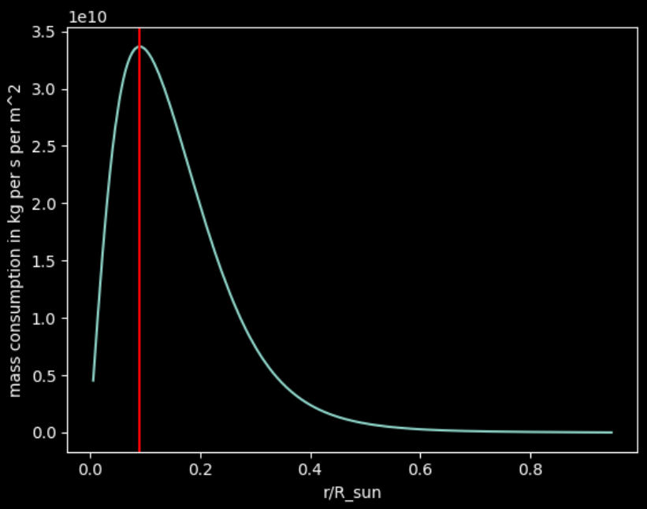

# Black hole star poisonin

## Random wide trajectory
https://github.com/filyp/black_hole_star_poisoning/assets/26285707/529d7ea4-a1e9-495e-9e23-068dcb9af57b

## Hungriest orbit
https://github.com/filyp/black_hole_star_poisoning/assets/26285707/3c902f17-1b12-4bdd-a7cd-cb9506e46c97

## Dropped from 20% of sun's radius
https://github.com/filyp/black_hole_star_poisoning/assets/26285707/85c24bfb-747b-4a28-9675-1eb1dba98a95

